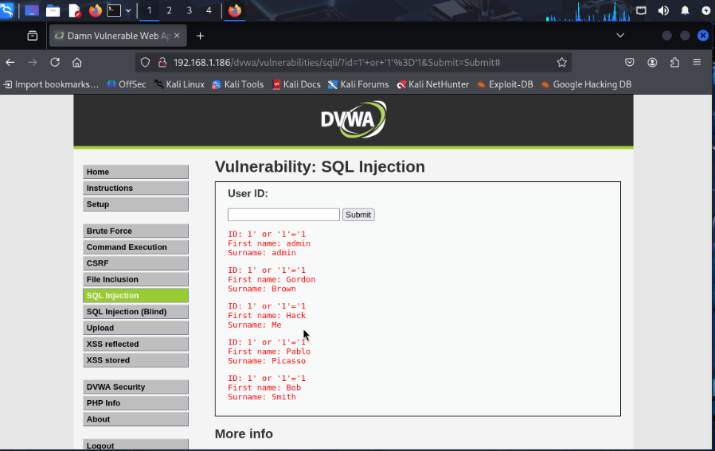

# DVWA Web Exploitation Lab

## Objective
The goal of this lab was to exploit a deliberately vulnerable web application (DVWA) to demonstrate a basic SQL Injection attack and understand how poor input validation can lead to authentication bypass.

## Environment
- Attacker: Kali Linux
- Target: DVWA (Damn Vulnerable Web Application)
- DVWA Security Level: Low

## Step 1: Access DVWA Login Page

The DVWA login page was accessed through the browser to identify potential input fields vulnerable to injection.

## Step 2: SQL Injection Attack

A simple SQL injection payload was entered into the username field to bypass authentication.

Payload used:
